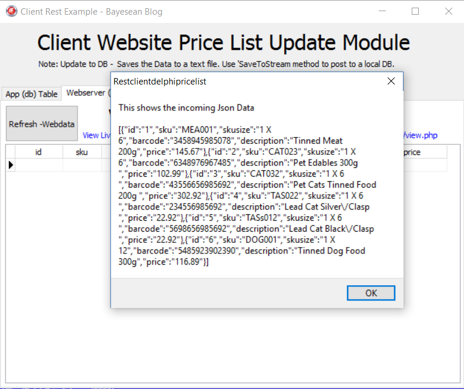
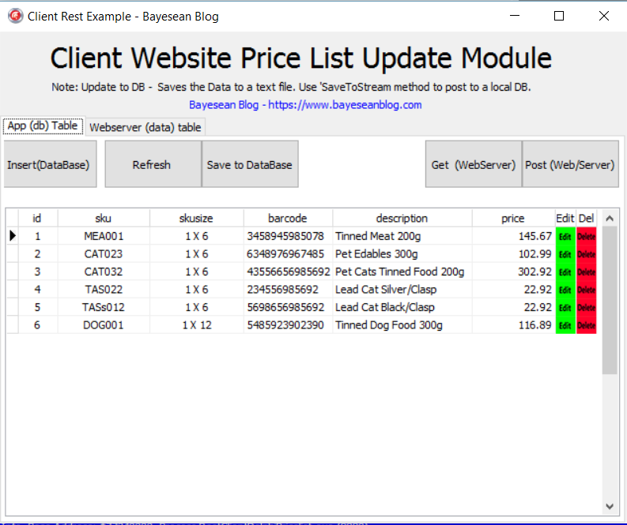
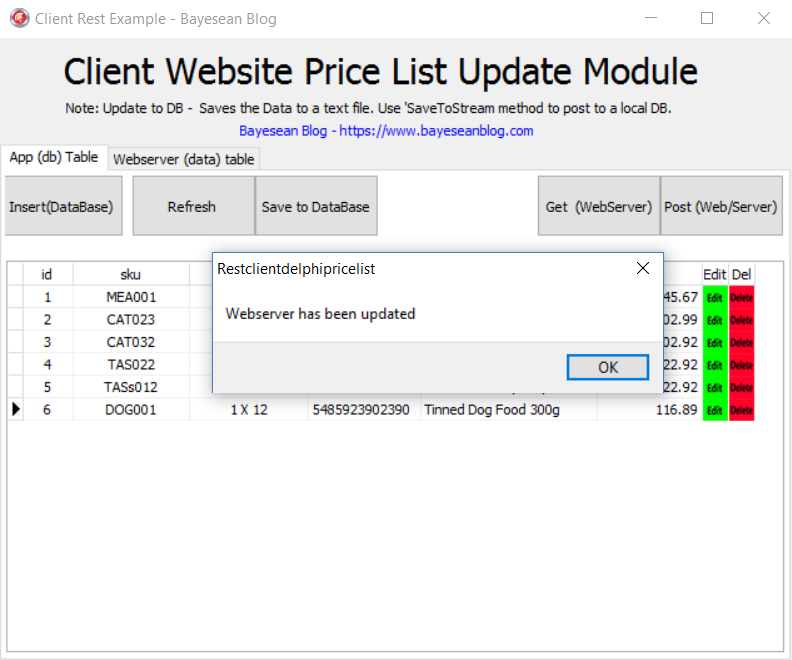

Part 3 VCL Rest Pricing Client Application

**Background**

This is a VCL Rest Pricing Client Application at a fundamental working level.
This App can easily be incorporated into a functional Windows Ribbon Styled or
Modern Windows 10 styled Application. This App will fast track your development
should you lack experience in Rest Client Development.

A rest server application is live and this application will connect directly to
the live server for testing.

**Scope**

-   The Application required the REST calls to be made in JSON.

-   The Application must be able to send a GET REST call to receive the actual
    SERVER Price List.

-   View in a Grid.

-   Must be able to save the Web-Site Pricelist directly to application’s LOCAL
    DB.

-   View the LOCAL DB Pricelist in Grid.

-   Perform the CRUD (Create, Read, Update, Delete) functions to the Local-DB
    Pricelist.

-   Must update the Web-Server Pricelist.

**Required**

-   Delphi IDE VCL with the latest INDY library loaded.

-   [superobject](https://github.com/hgourvest/superobject) Library for JSON
    processing.

What Libraries are created?

-   Delete Rest Response library and

-   JSON Parser library

**Application**

This application requires a Database to operate so a simulated json.txt database
is used. The Clientdataset is used as the in-memory database to communicate to
the DBgrids.

A pagecontrol is added to the mainform with two tabs:-

-   App(db) table – interacts with the local database

-   Webserver (data) table – interacts with the data in the rest server.

The Application will start with the Webserver data being updated in a grid. The
purpose is to compare the local pricing with the Webserver pricing. This data
can also be transferred to the App side pricing to edit change and send back to
the webserver and then synchronise the webserver with the local database.

The App(db) table - has the CRUD functions where all the editing takes place.

Two libraries DatasetUtils.pas and JsonDatasetConverter.pas are used for Dataset
calls…

UnMarshalltoDataset, ClientDatasetToJson, CreateField and CreateDatasetField.

All data is converted to Json for database saving and for sending to the
rest-server.

-   Instead of creating a local DB parser to compare the two database tables
    (local and Server) which would require synchronising of changed data
    followed by making a multitude of PUT and POST calls to the Webserver to
    synchronise the data.

-   The easiest option is as follows:-

    -   First Delete all the data in the REST Server Database. In Part 1 it has
        a REST call to Delete all …Delete /0 which truncates (clears the
        contents and sets the index key to 0) the Restserver Database table.

    -   A call is made to first Delete all data followed by a call to POST the
        Edited local DB data to the now empty REST Server Database table.

-   Now both the Local Application Database and Rest Server Database are
    synchronised.

    On PostwebserverbtnClick, the data is saved to the simulated Database then
    the DBGrid is reloaded.

    {code}

    procedure Tfmmain.PostwebserverbtnClick(Sender: TObject);

    var

    http: TIDHttp;

    response: string;

    jsonresponse: string;

    jsontoweb: Tstream;

    begin

    // save to simulated DB before sending Post data

    SavetosimulatedDB;

    LoadfromsimulatedDB;

    begin

    http := TIDHttp.Create(nil);

    http.HandleRedirects := true;

    http.ReadTimeout := 5000;

    http.MaxAuthRetries := 0;

    http.HTTPOptions := [hoKeepOrigProtocol];

    { for using Header Authorization

    //Http.HTTPOptions := [hoInProcessAuth];

    // Http.Request.CustomHeaders.Clear;

    // Http.Request.CustomHeaders.AddStrings('');

    //http.Request.BasicAuthentication := true;

    // Http.Request.Username := '';

    // Http.Request.Password := ''; }

    http.Request.Accept := 'http';

    http.Request.ContentType := 'application/json';

    try

    // need to have delete/all in API for this to work and clear the id's

    response := http.Delete

    ('http://www.bayeseanblog.com/blog/public/demo/salesrest/public/api/pricing/delete/0');

    // Showmessage(response);

    except

    on E: EIdHTTPProtocolException do

    Showmessage('Could not Connect to the Internet - Connection error!');

    // connection with a client in a "peaceful" way

    on E: EIdConnClosedGracefully do

    Showmessage

    ('Could not connect to the Internet - Connection was closed gracefully!');

    // this exception class covers all the low level socket exceptions

    on E: EIdSocketError do

    Showmessage

    ('Could not Connect to the Internet - Connection socket error!');

    // this exception class covers all exceptions thrown by Indy library

    on E: EIdException do

    Showmessage

    ('Could not connect to the Internet - Connection error exception!');

    // all exceptions different from those listed above

    on E: Exception do

    Showmessage('Unable to connect to the Internet!');

    end;

    response := '';

    if not(ClientDataSet1.Active) then

    fmmain.ClientDataSet1.CreateDataSet;

    jsontoweb := TStringStream.Create(ClientDataSetToJSON(ClientDataSet1),

    System.SysUtils.TEncoding.UTF8);

    try

    // sends all data to rest api

    jsonresponse :=

    http.Post(

    'http://www.bayeseanblog.com/blog/public/demo/salesrest/public/api/pricing/add/all',

    jsontoweb);

    except

    on E: EIdHTTPProtocolException do

    Showmessage('Could not Connect to the Internet - Connection error!');

    // connection with a client in a "peaceful" way

    on E: EIdConnClosedGracefully do

    Showmessage

    ('Could not connect to the Internet - Connection was closed gracefully!');

    // this exception class covers all the low level socket exceptions

    on E: EIdSocketError do

    Showmessage

    ('Could not Connect to the Internet - Connection socket error!');

    // this exception class covers all exceptions thrown by Indy library

    on E: EIdException do

    Showmessage

    ('Could not connect to the Internet - Connection error exception!');

    // all exceptions different from those listed above

    on E: Exception do

    Showmessage('Unable to connect to the Internet!');

    end;

    Showmessage('Webserver has been updated');

    end;

    http.Free;

    jsonresponse := '';

    end;

    {/code}

    **Testing**

    The VCL Application is set to call directly to the Live Webserver. Live
    calls to save all are as follows:-
    'http://www.bayeseanblog.com/blog/public/demo/salesrest/public/api/pricing/add/all'

    The Application should function 100% . You may have to deactivate your
    Antivirus should it block the calls.

    Happy Coding…
